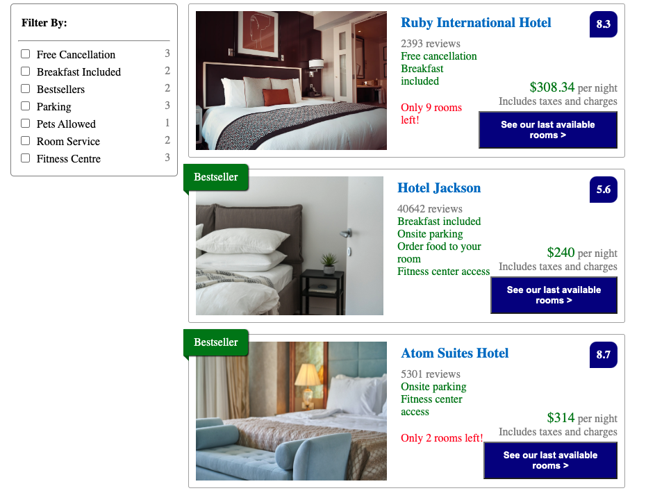

# Hotel Booking UI
The Hotel Booking UI is a simple web application built with React JS.

## About
With the Hotel Booking app, users can apply filters to find hotels that match their requirements. 

## Project Background
The app was part of the course work for Skillcrush's "Introduction to JavaScript React" course. The focus was on learning how to render array data models, and how to update user interfaces with stateful components. 

During this excercise, I practiced: 

- Exporting and importing components, rendering components, and passing props.
- Writing callback functions.
- Using the .map() method to map over an array data model with a callback function.

## Built with:
- React.js
- ES6 
- JSX
- CSS3
- HTML5

## Launch
[See the live version of the Hotel Booking app here.](https://suyj3v.csb.app/)

## Acknowledgements
**Skillcrush** - The app's HTML, CSS, and React files were provided by Skillcrush. I built on the code in the React files to complete the excercise with support and guidance from Skillcrush.   